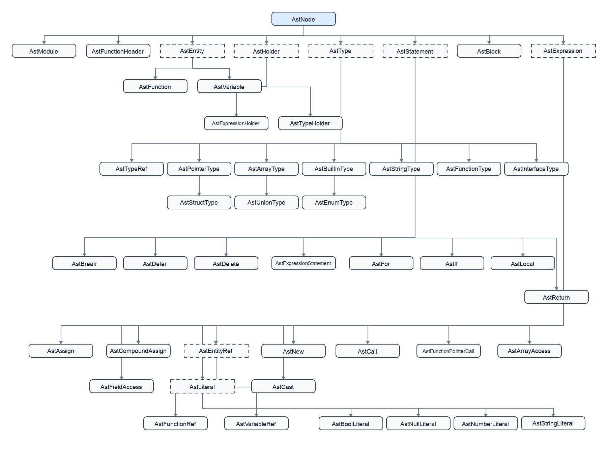

# Engineering Notes

## AST Class Hierarchy

The current AST class hierarchy is shown below.

## Function Lookup

If linear search within large overload groups becomes expensive, function signatures can be indexed
with a structural trie. Trie branches would represent nominal types, arrays, pointers, function
types, and wildcards. This would make lookup depend primarily on signature depth rather than the
number of overloads, without changing the language's overload-resolution rules.
